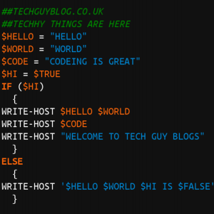

+++
archetype = "chapter"
title = "Tech Guy Blog (Archive)"
weight = 6
+++


Archived Posts from https://techguyblog.co.uk/  

Formatting will be borked

---  



Hi All, i am Chris, i am an IT Guy and this is my blog.

It will be filled of random IT – Related things, free software, useful scripts and my incoherent ramblings. Oh and of course some information on food.

An occasionally things like “What am i listening too today” to remind myself and readers that i am in fact a human. (or so the tell me)

Feel free to use the contact page to email me or use the Facebook link on the right.

## Powershell Top Tip

A quick Powershell tip for you lovely people.

Make sure comments do not clip the end of your code or it will break as bellow

```Powershell
Write-host "Hello World" -ForegroundColor red#red is good
```

However a space fixes it

```PowerShell
Write-host "Hello World" -ForegroundColor red #red is good
```

## A Random Quote

If you immediately know the candlelight is fire then the meal was cooked a long time ago


---

## Pages Not Moved Over

Contact  
Review on the Energy drink (It was just a cool can)  
Last Password change Replaced By [One Liners](../../PowerShell/OneLiners)  
Free software for education.  
Message to computers Replaced By [Mass Message](../../PowerShell/MassMessage)  

