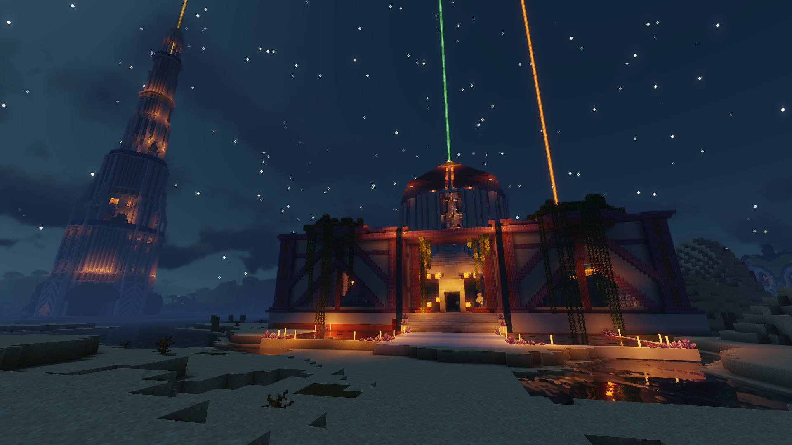
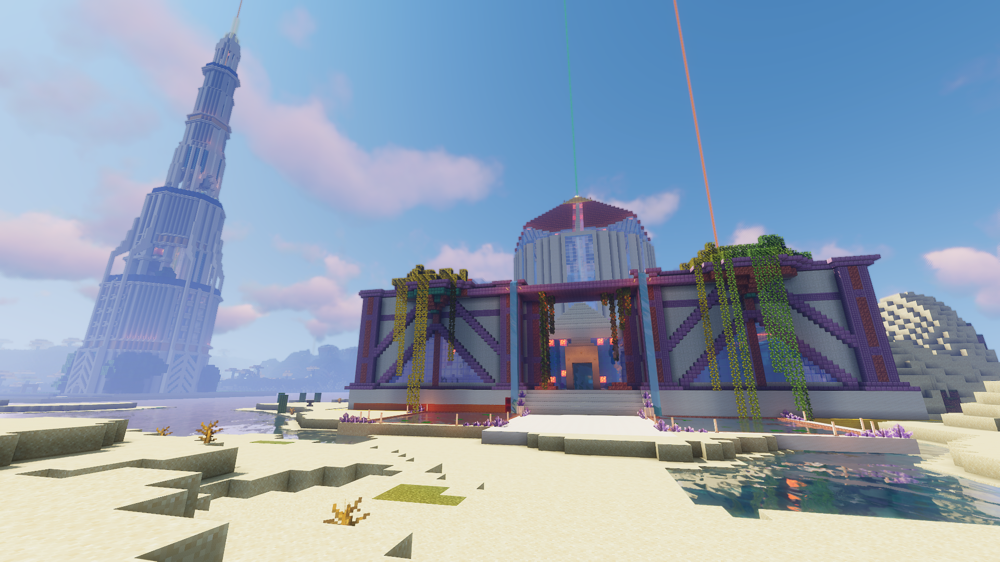
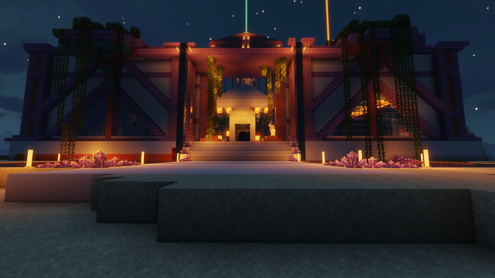
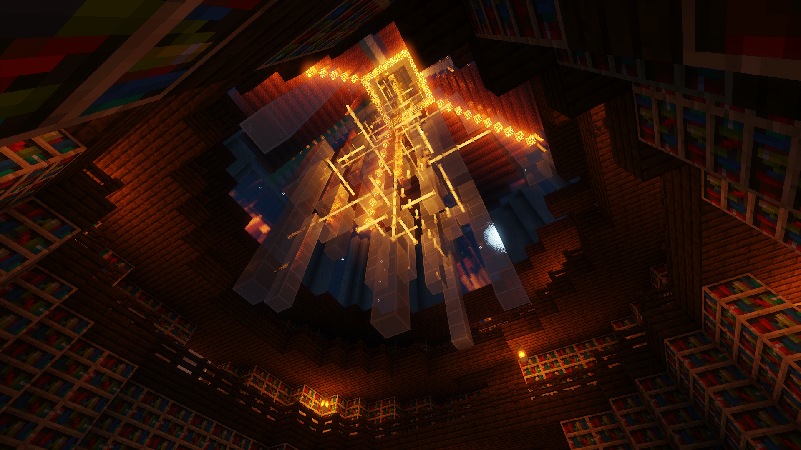
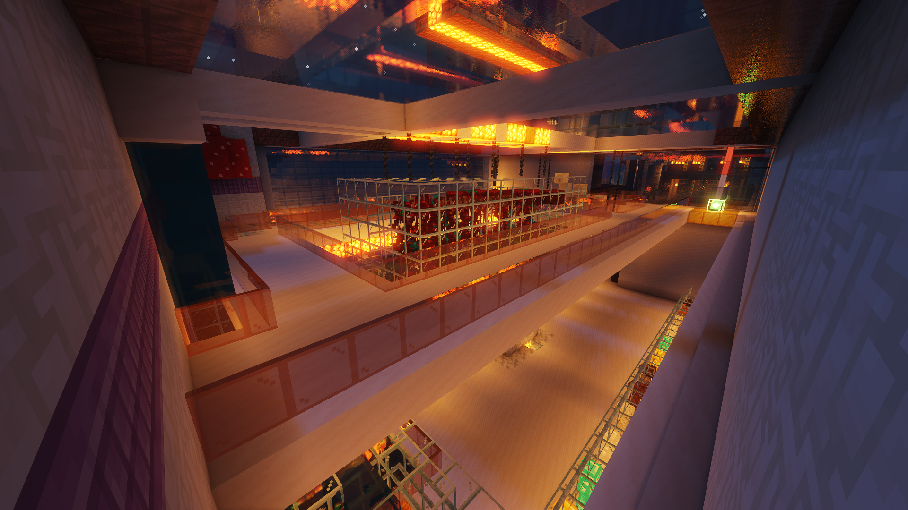
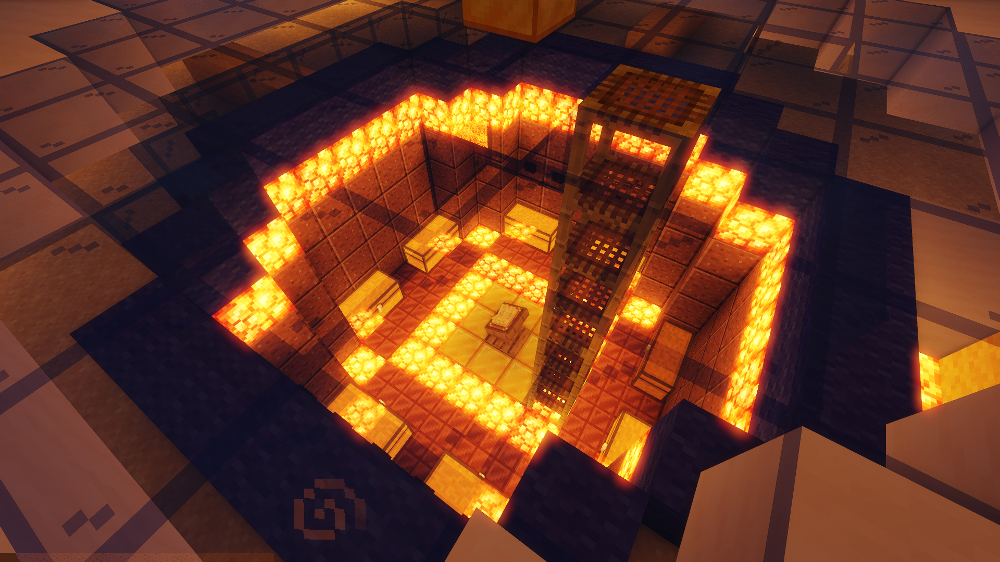
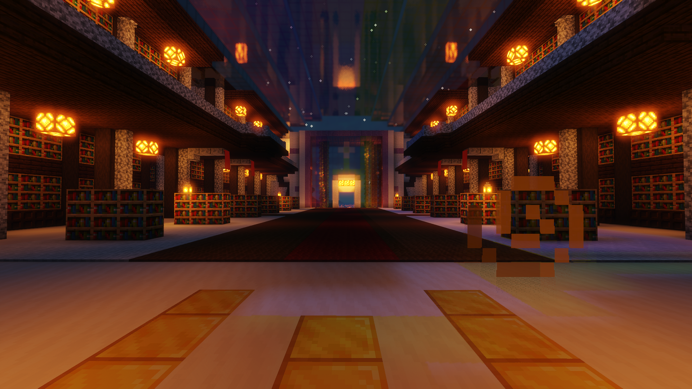
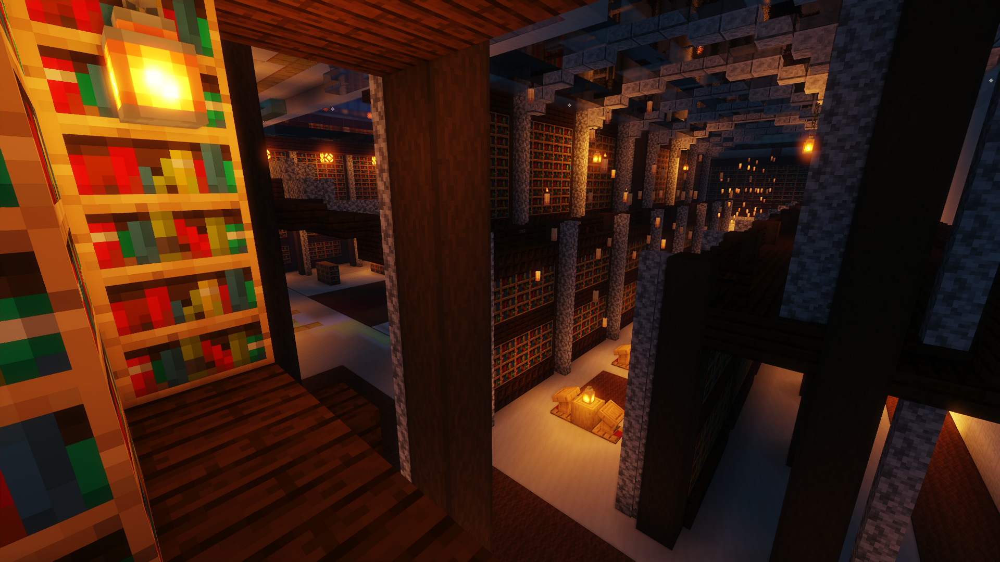
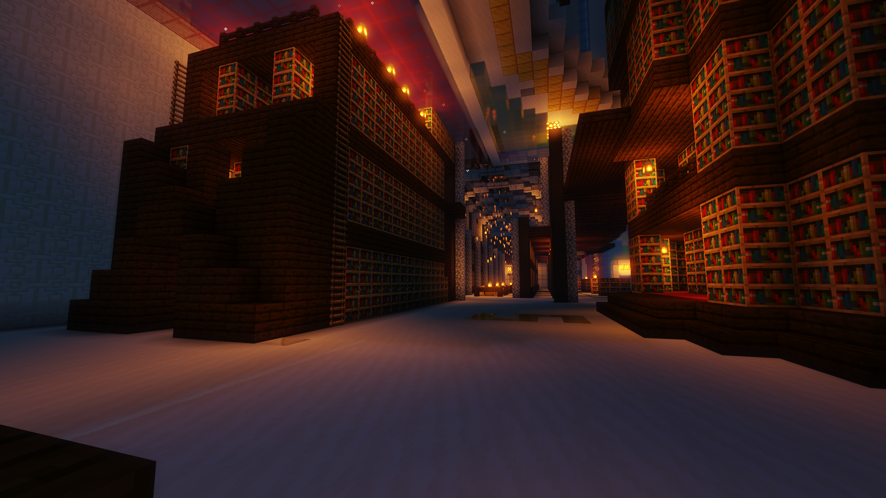
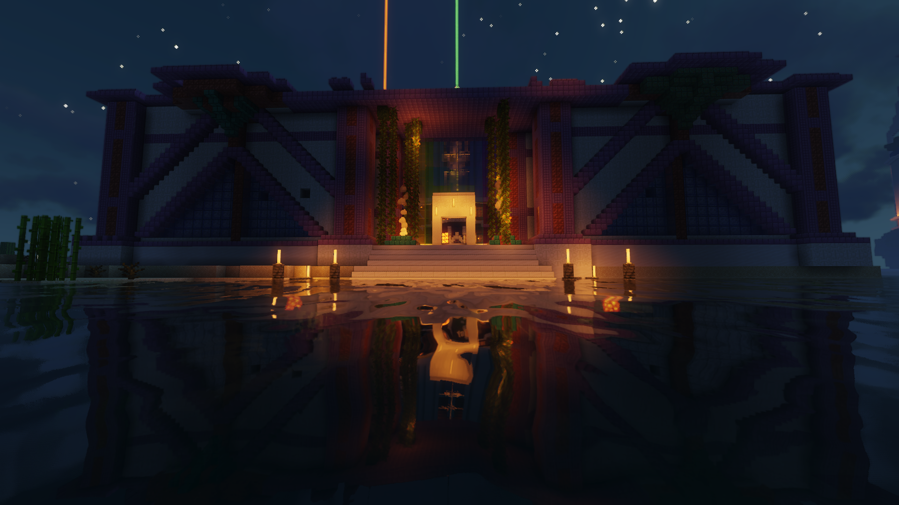

+++
title = 'Library Of Alexandria'
date = 2024-06-23T11:45:28+01:00
weight = 3
+++

A Wonderful Mega-build of a library / museum  
Many hours and Many people went into this build.  

The entrance with the lighthouse in the background  

## Grand Staircase  

A Staircase hidden away among the bookshelves  

## The Chandelier  

## Art  

The Kitten Guards of the Library  

A History of Armour and Fauna  

## The Vault  

a Near impenetrable vault to store the special books  

## The Books  

## The Docks  

For those whom wish to arrive by boat  

  
