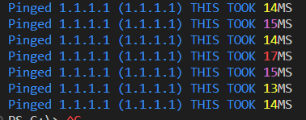

+++
title = 'Colour Ping'
date = 2024-02-08T20:04:15Z
weight = 3
+++

This script will ping an IP Address until told to stop, giving you a colour coded output depending on the set latency values.  
This for instance would allow you to be pinging a server and see the outliers of latency.  

## Notes

Example output of the script, using very aggressive values for testing/demo.  


## The Script itself  

[ColourPing.ps1](../../PowerShell/ColourPing.ps1)  

```powershell
$LowThreshold = 12 ## 0 - 12 shows green
$MedThreshold = 25 ## 13-25 Shows yellow, 25-50 orange
$ErrorThreshold = 50 ## Above 50 Shows text in red
$Target = "1.1.1.1" #read-host ## Comment this line out with ## and uncomment the bellow line to get it to ask you for input on each run
##$Target = read-host
while($true){
start-sleep(1) ## Wait 1 second
$Response = test-connection $Target -Count 1 #Do the ping
if (  $PSVersionTable.PSVersion -lt 7){ #Check PS Version as they change the output info for V7
  $Time = $Response | select -ExpandProperty ResponseTime
  $IPV4 = $Response | select -ExpandProperty IPV4Address
  $DEST = $Response | select -ExpandProperty Address 
}
else {
  $Time = $Response | select -ExpandProperty Latency
  $IPV4 = $Response | select -ExpandProperty Address
  $DEST = $Response | select -ExpandProperty Address 
}
  write-host "Pinged $DEST ($IPV4) THIS TOOK " -foregroundcolor blue -nonewline # Print info to console 
if ($time -le $LowThreshold){
  write-host $time -foregroundcolor green -nonewline
  write-host "MS"
}elseif($time -le $MedThreshold){
  write-host $time -foregroundcolor yellow -nonewline
  write-host "MS"
}elseif($time -le $ErrorThreshold){
  write-host $time -foregroundcolor magenta -nonewline
  write-host "MS"
}else{
  write-host $time -foregroundcolor red -nonewline
  write-host "MS"
}
}
```
