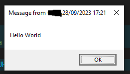

+++
title = 'Mass Message'
date = 2024-02-08T20:04:15Z
weight = 4
+++

This script will look through AD and send a message to all Computers that match a wildcard name, IE entering admin will match with admin-55, site1-admin, site1-amdin-11 etc.  
OR it will go through an OU Given by [Search Base](/../../PowerShell/#SearchBase)  

It will then display the message for the set time (MS) set to 600 by default.  

## Notes

Example output of the message shown.  


## The Script itself  

[MassMessage.ps1](../../PowerShell/MassMessage.ps1)  

```powershell
$ComputerName = read-host "Enter Computer name Do not include * For wild cards. it is added Automatically"
$Computers = Get-ADComputer -Filter "Name -like '*$ComputerName*'" | select-object -ExpandProperty name ##Gets all all Computers with a host name entered above
##Comment out the two lines above and uncomment the one bellow if you prefer to do it based on OU 
#$Computers = Get-ADComputer -SearchBase "OU=YOUROUHERE,DC=DOMAIN,DC=TLD" -Filter * | select-object -ExpandProperty name
$msg = read-host "Please enter your message" #Enter The Message you want it to be 
ForEach ($Computer in $Computers) {
    if (test-Connection $Computer -Count 1 -Quiet ) { 
    Write-Host "Sending $msg to $Computer"
    Invoke-WmiMethod `
        -Path Win32_Process `
        -Name Create `
        -ArgumentList "msg * /time:600 $msg" `
        -ComputerName $Computer
}
}
```
