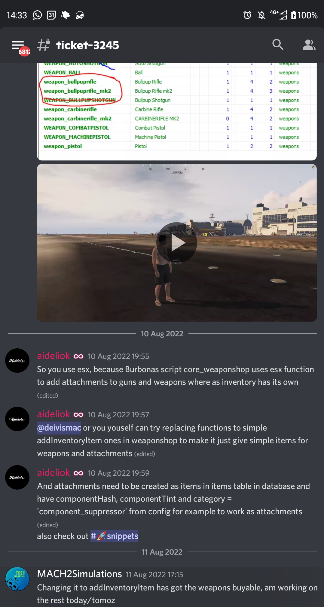

+++ 
title = "snippets"
+++

# Snippets

#FOR ESX
>https://github.com/esx-framework/esx-legacy/blob/26743c5417a81b0d62fcc61db5b835b36f1045bb/%5Besx%5D/es_extended/server/classes/player.lua#L68 round.  

>to find someone's backpack: find their ID in select identifier from users where firstname = 'usersfirstname' - find their inventory in select data from inventories where identifier = 'thatidentifier' - in the json, find the backpack and it has an itemId field. - find the backpack select data from inventories where identifier = 'backpack_itemId'

>tail the fx/fivem server log (in powershell): Get-Content -tail 50 -wait E:/live/txdata/default/logs/fxserver.log

>core1.png
