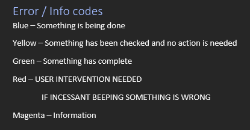

+++
title = '(Noodle) Script Goes Beep'
date = 2024-06-21T21:45:11+01:00
+++

Sometime Late time at the grammar.  

> I Realize as i started to prep to write this out it may not paint be in the best of lights...  
> This person whom i didn't help in this situation had ***far beyond*** what would be classed as normal support in learning the tools we used. Everyone in the dept had helped them at some point to learn this process.  
> This included several ***show***, ***tell*** and ***Watch*** walkthroughs of using this tool  
> And a guide which i feel could be handed to almost anyone and if taught how to open powershell how it was needed could likely run this process.  
> See also [Burnout]({})

### Create_MassUsers_Version_7.ps1  

This was a script i created, much pain and many, many revisions & optimizations later V7 was born.  

It ingested a CSV, created the users, the share permissions, (weird stuff needed for Onsite exchange & move to 365), created password sheets to be handed to users & a master sheet for new student onboarding to be used by the IT Teachers in the first few lessons.  
It could easily churn though 100s of users with no issue and was only slowed down by self imposed limits caused by AD replication.  
There was however almost no error checking, my assumption was the data would always be checked before being ran and in testing 1000s of test accounts i could never get it to fail if the data was correct...  

It worked ***Really*** Well and although i would remake it from scratch if i needed it again, i am still ***very*** proud of it and the documentation i made along with it.  

It had very verbose logging (Around 50 different printed messages)  

  

> IF INCESSANT BEEPING SOMETHING IS WRONG  

The script was pretty much set and forget. Plenty of other things to do that isn't watching powershell create 100 users. So there was audio feedback when the script was running if it was done or needed user intervention.  

Noodle was going to do the user creation for the new year 7's  

1) Sanity Check all data is there  
2) Open ISE  
3) Run script  
4) Paste CSV Path  

## Story

They started of the script, and then i could hear "beep beep beep".  Sometimes this happens if AD Rep is very slow and only happens once.  
Also, knowing the script, this was happening just after the user has been created, likely in one of the few error checks that checked if the user existed before doing stuff with permissions.  
The Script needed to be quit and then whatever was wrong fixed and then started again. Given this had only done a user or 2 the best allbeit bad option would have been to delete the ones created and start again.  

It took them an hour & forty+  minutes to notice and do something about it.  
They were ignoring the beeping i could hear across the room over my music  
They did not check the script to see if it was running in that time  

The users finally got created...  
Looking at the dates im not 100% sure if this was the new year 7s but it was deffo a good chunk of pupils...

---

> I don't know what to take from this tbh, even 3 years on.  
> One part of me says i should have said something 5 mins in.  
> The other part says sometimes people need to fail at a thing, and given this had 0 long term harm failing it  
> But also it should never have gotten to this point & i should really have spoken to the boss a long long time before this discussing my concerns and issues  
> See also [Burnout]({})
---

The irony is as this was happing i modified a copy of the script to play a dinosaur roar, for if / when this happens again, it would be far more obvious.  When Noodle copied the script again, it stopped working because it couldn't find the sound file.  
Script wasn't working, i brushed it off as user error and told them they need to do some troubleshooting.  
They didn't troubleshoot and just got the boss to come take a look (they sent an email 5 minutes after I said I couldn't help at the time). 30 second fix once I knew the error...  
***Shrug Emoji***  
